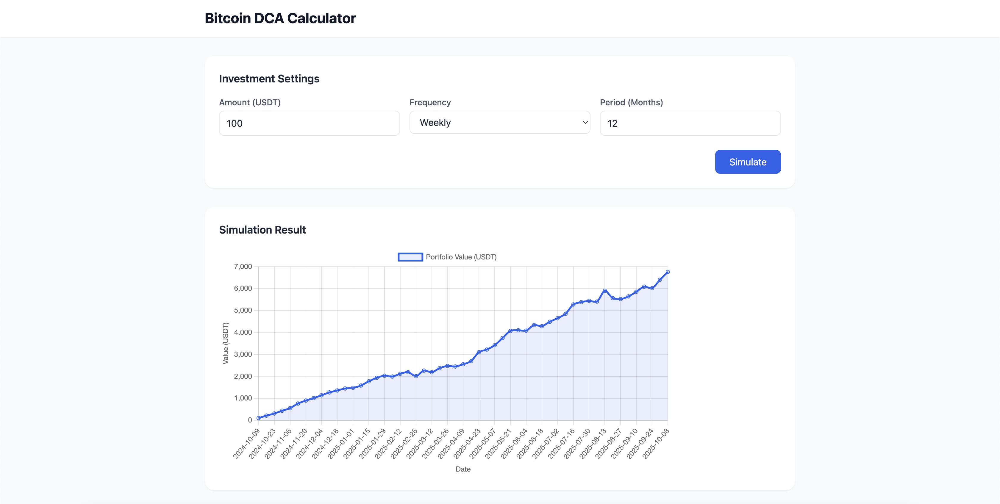

# Bitcoin DCA Calculator

A web application that simulates Dollar Cost Averaging (DCA) investment strategy for Bitcoin using historical price data from Binance API.

## Features

- **DCA Simulation**: Calculate historical performance of periodic Bitcoin investments
- **Flexible Parameters**: Choose investment amount, frequency (daily/weekly/monthly), and time period
- **Visual Analytics**: Interactive chart showing portfolio value over time
- **Performance Metrics**: View total invested, current value, and ROI
- **Real Data**: Uses actual historical Bitcoin prices from Binance

## Screenshot



## Tech Stack

### Frontend

- **Nuxt 3** - Vue.js framework
- **Tailwind CSS** - Styling
- **Chart.js** - Data visualization
- **TypeScript** - Type safety

### Backend

- **Node.js** - Runtime environment
- **Express.js** - Web framework
- **Binance API** - Historical price data

## Installation

### Prerequisites

- Node.js (v18 or higher)
- npm or yarn

### Setup

1. **Clone the repository**

```bash
git clone https://github.com/nathfred/dca-btc-backend.git
cd btc-dca-backend
```

2. **Install backend dependencies**

```bash
npm install
```

3. **Install frontend dependencies**

```bash
cd frontend
npm install
```

## Running the Application

### Start the Backend Server

```bash
# From the root directory
npm start
```

The backend will run on `http://localhost:3000`

### Start the Frontend

```bash
# From the frontend directory
cd frontend
npm run dev
```

The frontend will run on `http://localhost:3001`

## Usage

1. Open your browser and navigate to `http://localhost:3001`
2. Enter your investment parameters:
   - **Amount**: How much USDT to invest per period
   - **Frequency**: Choose daily, weekly, or monthly investments
   - **Period**: Total investment duration in months
3. Click **Simulate** to see results
4. View the chart showing portfolio value over time
5. Check summary cards for total invested, final value, and ROI

## API Endpoints

### GET `/api/simulate-dca`

Simulates a DCA investment strategy.

**Query Parameters:**

- `amount` (number) - Investment amount per period in USDT
- `frequency` (string) - Investment frequency: `daily`, `weekly`, or `monthly`
- `months` (number) - Total investment period in months

**Response:**

```json
{
  "startDate": "2024-09-20",
  "endDate": "2025-09-20",
  "totalInvested": 5300,
  "btcAccumulated": 0.05696833,
  "currentValue": 6910.03,
  "roi": 0.3037783285519243,
  "chartData": [...]
}
```

## Project Structure

```
btc-dca-backend/
├── frontend/              # Nuxt 3 frontend
│   ├── app.vue           # Main application component
│   ├── nuxt.config.ts    # Nuxt configuration
│   └── tailwind.config.js # Tailwind configuration
├── index.js              # Express backend server
├── package.json          # Backend dependencies
└── README.md            # This file
```

## License

MIT

## Contributing

Pull requests are welcome. For major changes, please open an issue first to discuss what you would like to change.

## Acknowledgments

- Historical price data provided by [Binance API](https://www.binance.com/en/binance-api)
- Built with [Nuxt](https://nuxt.com/) and [Chart.js](https://www.chartjs.org/)
